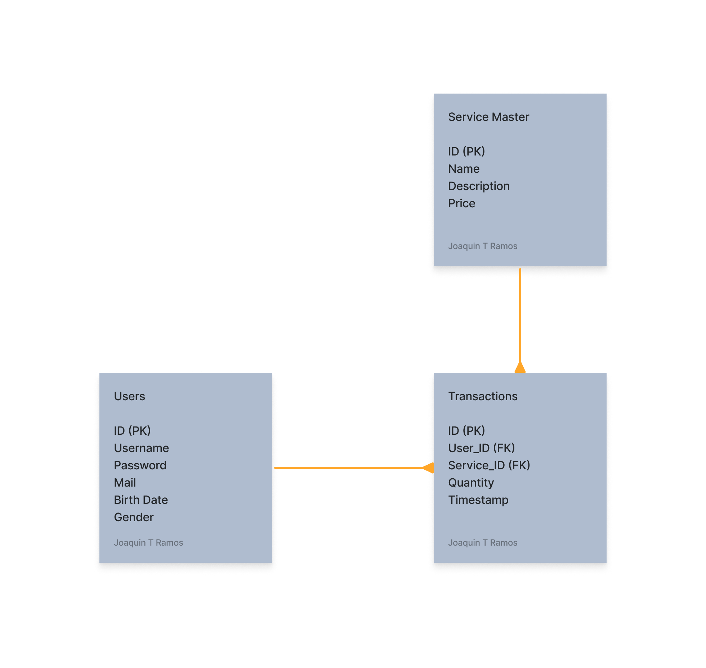

# Entrega 2
## Creación de DB, Generación y Visualización de Datos

### Base de Datos

Nosotros creamos la Base de Datos en un Azure Postgres 16 Flex Server utilizando los 100 USD acreditados por estudiantes. Esta misma contiene 3 tablas:

* Users
* Transactions
* Service Master

Este es nuestro diseño del mismo.

### Generación de Datos

Nosotros utilizamos las librerias que se encuentran en requirements.txt.

Para el uso de esta sección de la entrega, deberán pedir a cualquiera de los integrantes el secrets.json con los datos y ponerlo en la misma carpeta que el main.py.

Destacamos el uso de encrypción para las contraseñás de los usuarios. Las funciones son las siguientes:

* random_to_users(iterations) - Ingresa una cantidad de usuarios nuevos a la base de datos.
* random_to_transactions(iterations) - Ingresa una cantidad de transacciones nuevas a la base de datos. Como los datos dentro de la tabla "Transactions" se encuentran asociados a las otras dos, primero realiza un query para obtener de la cantidad de usuarios en la DB y una lista de los servicios disponibles.
* input_service_master(...) - Toma información ingresada por el usuario y la ingresa a la base de datos en forma de servicio.

### PowerBI

Nosotros decidimos en utilizar PowerBI por su facil integración con nuestra base de datos.

[Link al PowerBI](EntregableBI.pbix). Les recuerdo refrescar la hoja para ver los resultados nuevos e ingresar los mismos datos que en secrets.json

### Autores

Joaquin Ramos, Franco Moggia e Ignacio Alfasso